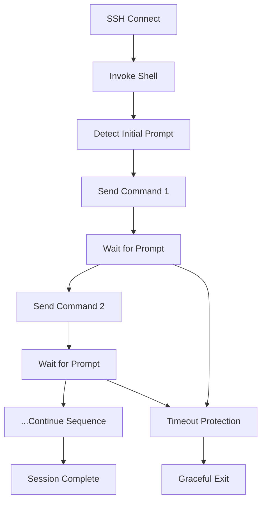
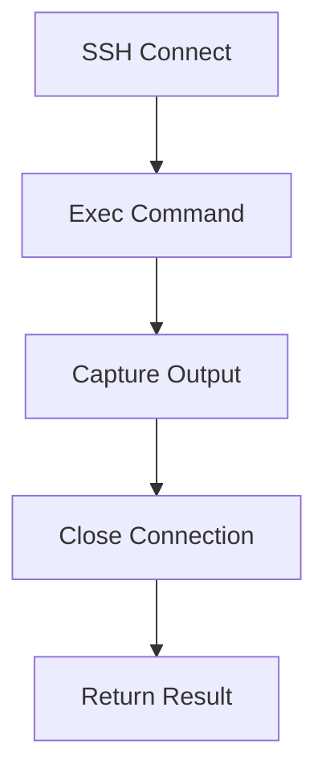

# SSHWontDie - Multi-Language SSH Automation Toolkit

A comprehensive collection of SSH automation libraries implementing consistent methodologies across multiple programming languages. All libraries share a core architectural pattern: **invoke-shell mode with prompt synchronization** for reliable multi-command execution, plus traditional exec mode for simple operations.

## 🌟 Project Overview

SSHWontDie provides battle-tested SSH automation capabilities across 6 programming languages, each implementing the same core architectural pattern:

## 🎯 Universal Design Pattern

All libraries implement a **dual-mode approach** with consistent command-line interfaces:

### 1. **Invoke-Shell Mode** (Recommended for Network Devices)
- Establishes persistent shell session  
- Intelligent prompt detection and synchronization
- Multi-command sequences with proper timing
- Handles interactive prompts and paging
- Maintains state across command sequences

### 2. **Exec Mode** (Simple Operations)
- Direct command execution via SSH exec channel
- Single command per connection
- Suitable for simple, one-off operations
- No prompt management needed

### 3. **Shared Core Features**
- **Adaptive Prompt Detection** - Robust command prompt handling across vendors
- **Multi-Vendor Support** - Cisco, Arista, Juniper, HP, Fortinet, Palo Alto, Linux, Windows  
- **Intelligent Device Fingerprinting** - Automatic vendor/OS detection (pspn, C#)
- **Production-Ready** - Error handling, logging, retry logic, connection recovery

## 📚 Library Collection

| Language | Library | Maturity | Key Features |
|----------|---------|----------|---------------|
| **Python** | [pspn](./pspn/) | 🟢 **Flagship** | Complete fingerprinting, ping parsing, CLI interface, 13+ device types |
| **Python** | [pysshpass](./pysshpass/) | 🟡 **Stable** | TTP templates, structured parsing, examples |
| **Go** | [gsshpass](./gsshpass/) | 🟠 **Basic** | Shell/exec modes, keyboard-interactive auth, cipher negotiation |
| **C#** | [sshpasscsharp](./sshpasscsharp/) | 🟡 **Advanced** | Device fingerprinting, CLI interface, JSON output |
| **Node.js** | [sshjs](./sshjs/) | 🟠 **Basic** | Shell/exec modes, prompt detection, async patterns |
| **Java** | [sshpassj](./sshpassj/) | 🟠 **Basic** | Shell/exec modes, logging, basic error handling |

## 🚀 Quick Start by Language

### Python (pspn) - Flagship Implementation

```bash
cd pspn
./spn_cli.py --host 192.168.1.1 -u admin -p password --fingerprint --verbose
```

```python
from device_fingerprint import DeviceFingerprint

fingerprinter = DeviceFingerprint("192.168.1.1", 22, "admin", "password")
device_info = fingerprinter.fingerprint()
print(f"Device: {device_info.device_type.name} - {device_info.hostname}")
```

### Python (pysshpass) - Template-Based Parsing

```python
from PySSHPass.pysshpass import SSHClient

client = SSHClient('192.168.1.1', 'admin', 'password')
client.connect()
result = client.send_command('show version')
client.disconnect()
```

### Go (gsshpass) - Basic SSH Client

```bash
cd gsshpass
./gsshpass.exe -h 192.168.1.1 -u admin -p password -c "show version"
# Shell mode with prompt detection
./gsshpass.exe -h 192.168.1.1 -u admin -p password -c "show version,show ip route" --invoke-shell --prompt "Router#"
```

### C# (sshpasscsharp) - Advanced Fingerprinting

```bash
cd sshpasscsharp/publish
# Device fingerprinting with detailed output
./spn.exe --host 192.168.1.1 -u admin -p password --fingerprint --verbose
# Execute commands after fingerprinting
./spn.exe --host 192.168.1.1 -u admin -p password --fingerprint -c "show version,show inventory" --save output.txt
```

### Node.js (sshjs) - Basic SSH Operations

```javascript
const runSSHCommand = require('./src/sshClient');

const result = await runSSHCommand({
    host: '192.168.1.1',
    user: 'admin', 
    password: 'password',
    cmds: 'show version,show ip route',
    invokeShell: true,
    prompt: 'Router#',
    promptCount: 1,
    timeoutDuration: 30
});
```

### Java (sshpassj) - Basic Enterprise Client

```bash
cd sshpassj
# Basic command execution
java -jar target/sshpassj-1.0-SNAPSHOT.jar --hostname 192.168.1.1 -u admin -p password -c "show version"
# Shell mode with prompt detection  
java -jar target/sshpassj-1.0-SNAPSHOT.jar --hostname 192.168.1.1 -u admin -p password -c "show version,show ip route" --invoke-shell --prompt "Router#"
```

## 🏗️ Universal Architecture Pattern

All libraries implement the same battle-tested methodology centered around **invoke-shell mode with prompt synchronization**:

### Invoke-Shell Command Flow



### Key Synchronization Features

1. **Prompt Pattern Matching**
   - Detects device-specific prompts automatically
   - Handles config mode changes (Router# → Router(config)#)
   - Supports custom prompt patterns via CLI arguments

2. **Command Sequencing**
   - Waits for prompt before sending next command
   - Configurable inter-command timing
   - Handles empty commands (sends newline for prompt refresh)

3. **Session Management**
   - Maintains persistent shell throughout command sequence
   - Tracks prompt count for reliable exit conditions
   - Timeout protection prevents hanging sessions

### Exec Mode (Alternative)



For simple, single-command operations where prompt synchronization isn't needed.

### 2. **Consistent CLI Pattern Across All Languages**

Every implementation supports the same command-line interface pattern:

```bash
# Exec Mode (simple, single command)
<tool> --host 192.168.1.1 -u admin -p password -c "show version"

# Invoke-Shell Mode (multi-command with prompt sync)  
<tool> --host 192.168.1.1 -u admin -p password \
    --invoke-shell \
    --prompt "Router#" \
    --prompt-count 1 \
    -c "show version,show ip route,show interfaces"

# With timeout and timing controls
<tool> --host 192.168.1.1 -u admin -p password \
    --invoke-shell \
    --prompt "Router#" \
    --timeout 60 \
    --inter-command-time 2 \
    -c "terminal length 0,show running-config"
```

**Universal Parameters:**
- `--invoke-shell` - Enable persistent shell mode with prompt synchronization  
- `--prompt` - Expected prompt pattern for synchronization
- `--prompt-count` - Number of prompts to wait for before exit (default: 1)
- `--timeout` - Overall session timeout in seconds
- `--inter-command-time` - Delay between commands in seconds  
- `-c, --cmds` - Comma-separated command sequence

### 3. **Prompt Synchronization Techniques**

All implementations use sophisticated prompt management:

- **Multi-Method Detection** - Buffer analysis, active probing, pattern matching
- **Context Awareness** - Handles mode changes (enable → config → interface)  
- **Adaptive Patterns** - Learns unknown prompt formats dynamically
- **Timeout Protection** - Prevents hanging on unexpected output
- **State Tracking** - Maintains session state across command sequences

### 4. **Multi-Command Reliability**

The invoke-shell pattern solves common automation challenges:

```bash
# Problem: Traditional approach requires multiple connections
ssh device "show version"  # Connection 1
ssh device "show ip route" # Connection 2  
ssh device "show config"   # Connection 3

# Solution: Single shell session with prompt synchronization
sshwontdie --invoke-shell --prompt "Router#" \
  -c "show version,show ip route,show config"
```

**Benefits:**
- ✅ Single authentication per device
- ✅ Maintains session state and context
- ✅ Handles configuration mode sequences  
- ✅ Proper command timing and synchronization
- ✅ Reliable output capture without truncation

## 🎯 Flagship Library: pspn (Python SSHPass Next Gen)

The most mature and feature-complete implementation:

### Advanced Features

- **Comprehensive Device Support** - 13+ device types with vendor-specific handling
- **Ping Output Parser** - Multi-vendor ping result parsing with statistics
- **JSON Output** - Structured data for automation integration  
- **CLI Interface** - Full-featured command-line tool
- **Batch Processing** - Handle multiple devices efficiently
- **Template System** - Extensible device profiles

### Device Fingerprinting Capabilities

```json
{
  "Host": "192.168.1.1",
  "DeviceType": "CiscoIOS",
  "Hostname": "Router01",  
  "Model": "ISR4331",
  "Version": "16.09.04",
  "SerialNumber": "FDO12345678",
  "Interfaces": {
    "GigabitEthernet0/0/0": "Status: up, IP: 192.168.1.1/24"
  },
  "CommandOutputs": {
    "show version": "Cisco IOS Software...",
    "show inventory": "..."
  }
}
```

### Supported Device Matrix

| Vendor | Types | Commands | Pagination |
|--------|-------|----------|------------|
| **Cisco** | IOS, NX-OS, ASA | ✅ Full | ✅ Auto |
| **Arista** | EOS | ✅ Full | ✅ Auto |
| **Juniper** | JunOS | ✅ Full | ✅ Auto |
| **HP/Aruba** | ProCurve, ArubaOS | ✅ Full | ✅ Auto |
| **Fortinet** | FortiOS | ✅ Full | ✅ Auto |
| **Palo Alto** | PAN-OS | ✅ Full | ✅ Auto |
| **Linux** | All Distros | ✅ Basic | N/A |
| **Windows** | Server/Desktop | ✅ Basic | N/A |

## 🔧 Common Use Cases

### Network Configuration Sequences

```bash
# Configure interface via shell mode with proper sequencing
./pspn/spn_cli.py --host 192.168.1.1 -u admin -p password \
    --invoke-shell --prompt "Router#" \
    -c "configure terminal,interface gi0/1,ip address 10.1.1.1 255.255.255.0,no shutdown,end"
```

### Multi-Device Command Execution

```bash
# Execute same command sequence across multiple devices
for device in router1 router2 router3; do
    ./gsshpass/gsshpass -h $device -u admin -p password \
        --invoke-shell --prompt "#" \
        -c "show version,show memory,show processes cpu"
done
```

### Configuration Backup with Context

```bash
# Backup running config with proper shell context
./sshpasscsharp/publish/spn.exe --host 192.168.1.1 -u admin -p password \
    --invoke-shell --prompt "Router#" \
    -c "terminal length 0,show running-config" \
    --save "backup_$(date +%Y%m%d).txt"
```

### Interactive Configuration Sessions

```javascript
// Node.js - Handle configuration mode changes
const result = await runSSHCommand({
    host: '192.168.1.1',
    user: 'admin',
    password: 'password', 
    cmds: 'configure terminal,interface ethernet1/1,ip address 10.1.1.1/24,exit,exit',
    invokeShell: true,
    prompt: 'Router#',  // Will handle Router(config)# automatically
    promptCount: 4,     // Wait for return to Router# after exits
    timeoutDuration: 30
});
```

### Troubleshooting Sequences

```java
// Java - Execute diagnostic sequence
java -jar sshpassj.jar --hostname 192.168.1.1 -u admin -p password \
    --invoke-shell --prompt "Router#" \
    -c "show interfaces,show ip route,show arp,ping 8.8.8.8" \
    --inter-command-time 2
```

## 🚦 Choosing the Right Library

### Use pspn (Python) when:
- ✅ You need comprehensive device fingerprinting (13+ device types)
- ✅ Working with mixed vendor environments  
- ✅ Require structured JSON output
- ✅ Building automation workflows
- ✅ Need ping parsing capabilities
- ✅ Want mature CLI interface

### Use pysshpass (Python) when:
- ✅ You prefer template-based parsing (TTP)
- ✅ Need structured data extraction
- ✅ Working with standardized outputs
- ✅ Have existing TTP templates

### Use gsshpass (Go) when: 
- ✅ Need simple SSH execution without dependencies
- ✅ Want single-binary deployment
- ✅ Working with devices requiring specific cipher support
- ✅ Basic shell/exec mode operations
- ⚠️ Limited to basic SSH operations (no fingerprinting)

### Use sshpasscsharp (C#) when:
- ✅ Enterprise .NET environments
- ✅ Need device fingerprinting capabilities
- ✅ Want structured JSON output
- ✅ Building Windows-centric tools
- ✅ Strong typing and IDE support

### Use sshjs (Node.js) when:
- ✅ Building web applications
- ✅ Need async/await patterns
- ✅ JavaScript/TypeScript environments  
- ✅ Basic SSH operations with prompt detection
- ⚠️ Limited feature set compared to Python versions

### Use sshpassj (Java) when:
- ✅ Enterprise Java environments
- ✅ Need basic SSH execution with logging
- ✅ Shell and exec mode support
- ✅ JVM ecosystem integration
- ⚠️ No fingerprinting capabilities yet

## 🧪 Testing and Validation

Each library has been tested against:

- **Cisco**: ISR, ASR, Catalyst, Nexus, ASA series
- **Arista**: 7000, 7500 series switches  
- **Juniper**: SRX, EX, QFX series
- **HP/Aruba**: ProCurve 2xxx, 5xxx series
- **Fortinet**: FortiGate 60-3000 series
- **Palo Alto**: PA-220 through PA-5000 series
- **Linux**: Ubuntu, CentOS, RHEL, Debian
- **Windows**: Server 2016/2019/2022, Windows 10/11

## 📊 Feature Comparison Matrix

| Feature | pspn | pysshpass | gsshpass | sshpasscsharp | sshjs | sshpassj |
|---------|------|-----------|----------|---------------|-------|----------|
| **Invoke-Shell Mode** | ✅ | ✅ | ✅ | ✅ | ✅ | ✅ |
| **Exec Mode** | ✅ | ✅ | ✅ | ✅ | ✅ | ✅ |
| **Prompt Synchronization** | ✅ Advanced | ✅ Basic | ✅ Basic | ✅ Advanced | ✅ Basic | ✅ Basic |
| **Multi-Command Sequences** | ✅ | ✅ | ✅ | ✅ | ✅ | ✅ |
| **Timeout Management** | ✅ | ✅ | ✅ | ✅ | ✅ | ✅ |
| **Inter-Command Timing** | ✅ | ✅ | ✅ | ✅ | ✅ | ✅ |
| **Device Fingerprinting** | ✅ Full | ❌ | ❌ | ✅ Full | ❌ | ❌ |
| **Multi-Vendor Support** | ✅ 13+ Types | ✅ Via TTP | ❌ | ✅ 13+ Types | ❌ | ❌ |
| **JSON Output** | ✅ | ❌ | ❌ | ✅ | ❌ | ❌ |
| **CLI Interface** | ✅ Full | ✅ Examples | ✅ Basic | ✅ Full | ✅ Basic | ✅ Basic |
| **Ping Parser** | ✅ | ❌ | ❌ | ❌ | ❌ | ❌ |
| **TTP Templates** | ❌ | ✅ | ❌ | ❌ | ❌ | ❌ |
| **Keyboard Interactive** | ✅ | ✅ | ✅ | ✅ | ❌ | ❌ |
| **Cipher Negotiation** | ✅ | ✅ | ✅ Advanced | ✅ | ✅ Basic | ✅ |
| **Connection Recovery** | ✅ | ✅ | ❌ | ✅ | ❌ | ❌ |
| **Pagination Handling** | ✅ Auto | ✅ Manual | ❌ | ✅ Auto | ❌ | ❌ |
| **Logging** | ✅ | ✅ | ❌ | ✅ | ❌ | ✅ |

## 🔒 Security Considerations

- **Credential Management** - Secure password handling
- **Connection Encryption** - SSH2 with strong ciphers
- **Host Key Verification** - Configurable host key policies
- **Audit Logging** - Comprehensive operation logging
- **Error Sanitization** - No credential leakage in logs

## 🤝 Contributing

We welcome contributions across all languages:

1. **Fork** the repository
2. **Choose** your preferred language implementation
3. **Follow** the existing patterns and methodologies
4. **Test** against real devices when possible
5. **Document** new features and device support
6. **Submit** pull requests with clear descriptions

### Development Priorities

1. **Device Support** - Add new vendor/model support
2. **Error Handling** - Improve robustness and recovery
3. **Performance** - Optimize for speed and memory usage
4. **Documentation** - Examples and use case guides
5. **Testing** - Automated testing against device simulators

## 🚦 Current Development Status

### Mature & Production Ready
- **pspn (Python)** - Complete feature set, actively maintained
- **sshpasscsharp (C#)** - Advanced fingerprinting, enterprise ready

### Stable & Functional  
- **pysshpass (Python)** - Solid with TTP integration, examples available

### Basic & Functional
- **gsshpass (Go)** - Core SSH operations, good cipher support
- **sshjs (Node.js)** - Basic operations, async patterns
- **sshpassj (Java)** - Basic operations, enterprise logging

### Development Roadmap

**Near Term Improvements:**
- Add fingerprinting to Go, Node.js, and Java versions
- Standardize CLI interfaces across all languages
- Add connection recovery to basic implementations
- Improve error handling and logging

**Medium Term Goals:**
- Unified configuration format across all libraries
- Network device simulators for testing  
- Performance optimization across implementations
- Documentation and example improvements


## 📄 License

Each library maintains its own license. Check individual directories for specific licensing terms.

## 🏆 Success Stories

SSHWontDie libraries are used in production by:

- **Network Operations Centers** - Device monitoring and management
- **System Integrators** - Multi-vendor network deployments  
- **MSPs** - Customer network automation
- **Enterprise IT** - Infrastructure management
- **DevOps Teams** - Network configuration as code

## 📞 Support and Community

- **Issues** - Report problems in the main repository
- **Discussions** - Share use cases and get help
- **Documentation** - Each library has detailed README files
- **Examples** - Real-world usage examples in each directory

---

**SSHWontDie** - Because your SSH connections shouldn't die, and your automation should just work.

*Choose your language, keep your methodology, get things done.*