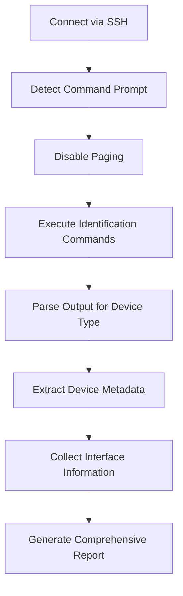

# SSHPassPython

A comprehensive Python library for automated network device discovery, fingerprinting, and command execution via SSH. SSHPassPython provides intelligent device identification, adaptive prompt detection, and vendor-specific command handling for network automation tasks.

## Features

### 🔍 **Intelligent Device Fingerprinting**
- Automatic detection of device types (Cisco IOS/NX-OS/ASA, Arista EOS, Juniper JunOS, HP/Aruba, FortiOS, Palo Alto, Linux, FreeBSD, Windows)
- Extracts device metadata: hostname, model, version, serial number, interfaces, IP addresses
- Vendor-specific command execution and output parsing
- Comprehensive device information collection and reporting

### 🎯 **Advanced Prompt Detection**
- Automatic command prompt detection and pattern matching
- Handles complex prompt scenarios (config mode, enable mode, multi-line prompts)
- Adaptive prompt recognition for unknown device types
- Robust handling of prompt variations and edge cases

### 🛡️ **Reliable SSH Communication**
- Multi-method authentication (password, keyboard-interactive)
- Connection recovery and retry mechanisms
- Automatic pagination handling for long command outputs
- Configurable timeouts and inter-command delays

### 📊 **Network Automation Tools**
- Ping output parsing library with multi-vendor support
- Command execution with shell and direct modes
- Comprehensive logging and debugging capabilities
- JSON output formatting for integration with other tools

## Installation

```bash
# Clone the repository
git clone <repository-url>
cd sshpasspython

# Install dependencies
pip install paramiko

# Make the CLI executable
chmod +x spn_cli.py
```

## Quick Start

### Basic Device Fingerprinting

```python
from device_fingerprint import DeviceFingerprint

# Create fingerprinter
fingerprinter = DeviceFingerprint(
    host="192.168.1.1",
    port=22,
    username="admin",
    password="password",
    debug=True
)

# Perform fingerprinting
device_info = fingerprinter.fingerprint()

if device_info.success:
    print(f"Device Type: {device_info.device_type.name}")
    print(f"Hostname: {device_info.hostname}")
    print(f"Model: {device_info.model}")
    print(f"Version: {device_info.version}")
    print(device_info.get_summary())
```

### Command Line Interface

```bash
# Basic device fingerprinting
./spn_cli.py --host 192.168.1.1 -u admin -p password --fingerprint --verbose

# Execute commands with fingerprinting
./spn_cli.py --host 192.168.1.1 -u admin -p password \
    --fingerprint \
    --cmds "show version,show ip interface brief" \
    --save output.txt

# Save fingerprint results to JSON
./spn_cli.py --host 192.168.1.1 -u admin -p password \
    --fingerprint \
    --fingerprint-output device_info.json
```

### SSH Command Execution

```python
from ssh_client import SSHClient, SSHClientOptions

# Configure SSH client
options = SSHClientOptions(
    host="192.168.1.1",
    username="admin",
    password="password",
    invoke_shell=True,
    timeout=30,
    debug=True
)

# Execute commands
client = SSHClient(options)
client.connect()

# Execute single command
result = client.execute_command("show version")
print(result)

# Disconnect
client.disconnect()
```

### Ping Output Parsing

```python
import parse_ping_lib as ppl

# Parse Cisco ping output
ping_output = """
Type escape sequence to abort.
Sending 5, 100-byte ICMP Echos to 8.8.8.8, timeout is 2 seconds:
!!!!!
Success rate is 100 percent (5/5), round-trip min/avg/max = 1/2/4 ms
"""

result = ppl.parse_ping_output(ping_output, platform="cisco_ios")
print(f"Success: {result['success']}")
print(f"Packet Loss: {result['packet_loss_percent']}%")
print(f"RTT Avg: {result['rtt_avg']}ms")
```

## Supported Devices

| Vendor | Device Types | Notes |
|--------|--------------|-------|
| **Cisco** | IOS, NX-OS, ASA | Full support for all major Cisco platforms |
| **Arista** | EOS | Complete EOS command support |
| **Juniper** | JunOS | JunOS-specific command handling |
| **HP/Aruba** | ProCurve, Aruba OS | HP and Aruba switch support |
| **Fortinet** | FortiOS | FortiGate firewall support |
| **Palo Alto** | PAN-OS | Palo Alto firewall support |
| **Generic** | Linux, FreeBSD, Windows | Unix/Linux/Windows server support |

## Architecture

### Core Components

1. **Device Fingerprinting (`device_fingerprint.py`)**
   - Orchestrates the device discovery process
   - Manages SSH connections and command execution
   - Coordinates vendor-specific identification logic

2. **Device Information (`device_info.py`)**
   - Defines device types and their capabilities
   - Stores comprehensive device metadata
   - Provides vendor-specific command mappings

3. **SSH Client (`ssh_client.py`)**
   - Handles SSH connectivity and authentication
   - Manages prompt detection and command execution
   - Provides robust error handling and recovery

4. **CLI Interface (`spn_cli.py`)**
   - Command-line interface for all operations
   - Integrates fingerprinting and command execution
   - Provides formatted output and logging

5. **Ping Parser (`parse_ping_lib.py`)**
   - Multi-vendor ping output parsing
   - Extracts metrics: packet loss, RTT, success rates
   - Supports Cisco, Arista, HP, and generic formats

### Fingerprinting Process



## Advanced Usage

### Custom Device Types

```python
from device_info import DeviceInfo, DeviceType

# Extend DeviceType enum for custom devices
class CustomDeviceType(DeviceType):
    CustomOS = 100
    
    def get_disable_paging_command(self):
        if self == CustomDeviceType.CustomOS:
            return "set terminal length 0"
        return super().get_disable_paging_command()
```

### Prompt Detection Customization

```python
from ssh_client import SSHClient, SSHClientOptions

# Custom prompt detection
options = SSHClientOptions(
    host="192.168.1.1",
    username="admin",
    password="password",
    invoke_shell=True,
    expect_prompt="router(config)#",  # Specific prompt
    expect_prompt_timeout=10000       # 10 second timeout
)
```

### Batch Device Processing

```python
import json
from device_fingerprint import DeviceFingerprint

devices = [
    {"host": "192.168.1.1", "username": "admin", "password": "pass1"},
    {"host": "192.168.1.2", "username": "admin", "password": "pass2"},
]

results = []
for device in devices:
    fingerprinter = DeviceFingerprint(**device)
    device_info = fingerprinter.fingerprint()
    results.append(device_info.to_dict())

# Save batch results
with open("network_inventory.json", "w") as f:
    json.dump(results, f, indent=2)
```

## Configuration Options

### SSH Client Options

| Parameter | Type | Default | Description |
|-----------|------|---------|-------------|
| `host` | str | Required | Target device IP/hostname |
| `port` | int | 22 | SSH port number |
| `username` | str | Required | SSH username |
| `password` | str | Required | SSH password |
| `invoke_shell` | bool | False | Use interactive shell mode |
| `expect_prompt` | str | None | Expected command prompt |
| `timeout` | int | 360 | Command timeout (seconds) |
| `shell_timeout` | int | 10 | Shell session timeout |
| `inter_command_time` | int | 1 | Delay between commands |
| `debug` | bool | False | Enable debug output |

### CLI Options

```bash
# Connection options
--host HOST          # SSH Host (ip:port)
-u, --user USER      # SSH Username  
-p, --password PASS  # SSH Password

# Execution options
-c, --cmds COMMANDS  # Commands to run (comma-separated)
--invoke-shell       # Use shell mode
--prompt PATTERN     # Prompt pattern to expect
-t, --timeout SEC    # Command timeout
-i, --inter-command-time SEC  # Delay between commands

# Fingerprinting options
-f, --fingerprint    # Enable device fingerprinting
-o, --fingerprint-output FILE  # Save fingerprint JSON
-v, --verbose        # Verbose output

# Output options
-s, --save FILE      # Save command output
--log-file FILE      # Log file path
-d, --debug          # Debug mode
```

## Output Formats

### Device Information JSON

```json
{
  "Host": "192.168.1.1",
  "Port": 22,
  "DeviceType": 1,
  "DetectedPrompt": "Router#",
  "DisablePagingCommand": "terminal length 0",
  "Hostname": "Router",
  "Model": "ISR4331",
  "Version": "16.09.04",
  "SerialNumber": "FDO12345678",
  "IPAddresses": ["192.168.1.1", "10.0.0.1"],
  "Interfaces": {
    "GigabitEthernet0/0/0": "Status: up, IP: 192.168.1.1/24",
    "GigabitEthernet0/0/1": "Status: down"
  },
  "CommandOutputs": {
    "show version": "Cisco IOS Software...",
    "show inventory": "NAME: \"Chassis\"..."
  },
  "FingerprintTime": "2025-01-15T10:30:00.000000",
  "Success": true
}
```

### Ping Parser Output

```json
{
  "success": true,
  "target_host": "8.8.8.8",
  "packets_sent": 5,
  "packets_received": 5,
  "packet_loss_percent": 0.0,
  "rtt_min": 1.0,
  "rtt_avg": 2.0,
  "rtt_max": 4.0,
  "timestamp": "2025-01-15T10:30:00.000000"
}
```

## Error Handling

The library implements comprehensive error handling:

- **Connection Errors**: Automatic retry with exponential backoff
- **Authentication Failures**: Clear error messages and fallback methods
- **Prompt Detection Failures**: Multiple detection strategies
- **Command Timeouts**: Configurable timeouts with graceful recovery
- **Device-Specific Issues**: Vendor-aware error handling

## Logging

```python
# Enable comprehensive logging
options = SSHClientOptions(
    host="192.168.1.1",
    username="admin", 
    password="password",
    debug=True,
    log_file="/var/log/sshpass/device.log"
)
```

Log files include:
- Connection establishment and teardown
- Command execution with timestamps
- Prompt detection attempts
- Error conditions and recovery actions
- Performance metrics

## Performance Considerations

- **Connection Pooling**: Reuse SSH connections when possible
- **Timeout Tuning**: Adjust timeouts based on device response times  
- **Batch Operations**: Process multiple devices in parallel
- **Output Filtering**: Use targeted commands to reduce data transfer
- **Caching**: Cache device information for repeated operations

## Contributing

1. Fork the repository
2. Create a feature branch (`git checkout -b feature/new-device-support`)
3. Implement changes with tests
4. Update documentation
5. Submit a pull request

### Adding New Device Support

1. Add device type to `DeviceType` enum in `device_info.py`
2. Implement vendor-specific patterns in `device_fingerprint.py`
3. Add identification commands and paging disable commands
4. Test with actual devices
5. Update documentation

## Troubleshooting

### Common Issues

**Connection Timeouts**
```bash
# Increase timeout values
./spn_cli.py --host 192.168.1.1 -u admin -p password --timeout 60
```

**Prompt Detection Failures**
```bash
# Specify explicit prompt pattern
./spn_cli.py --host 192.168.1.1 -u admin -p password --prompt "Router#"
```

**Authentication Issues**
```bash
# Enable debug mode for detailed connection info
./spn_cli.py --host 192.168.1.1 -u admin -p password --debug
```

**Unsupported Device Types**
- Check debug output for device identification clues
- Add custom patterns to `identify_vendor_from_output()`
- Contribute new device support back to the project

### Debug Mode

Enable debug mode for detailed execution information:

```python
# Python API
fingerprinter = DeviceFingerprint(
    host="192.168.1.1",
    username="admin",
    password="password",
    debug=True,
    verbose=True
)

# CLI
./spn_cli.py --host 192.168.1.1 -u admin -p password --debug --verbose
```

## License

[License information]

## Changelog

### Version 1.0.0
- Initial release with comprehensive device fingerprinting
- Multi-vendor ping parser support
- Robust SSH client with prompt detection
- Command-line interface with full feature set
- JSON output formatting for automation integration

---

**SSHPassPython** - Intelligent Network Device Automation